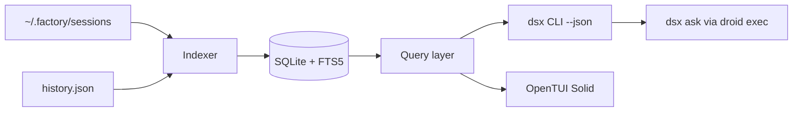

# dsx — Droid Session Explorer

Bun + TypeScript tool in `/home/ain3sh/projects/droid-search`. One binary, `dsx`: agent-first CLI + OpenTUI (Solid) TUI over an incremental SQLite index of `~/.factory/sessions`.

## 1. Index layer (`src/indexer/`)
- **Incremental**: JSONL is append-only. Track `(path, size, mtime, byte_offset)` per file; on refresh, parse only new bytes. Auto-refresh staleness check before every command (full first index ~30-60s over 3.3GB, then sub-second).
- **DB** at `~/.cache/dsx/index.db` via `bun:sqlite`, WAL mode.
- **Schema**:
  - `sessions` — id, dir_slug, cwd, title, created/updated ts, model, reasoning effort, autonomy, counts (msgs, tool calls, errors, compactions), token usage (input/output/cache/thinking/credits), active_time_ms, tags
  - `edges` — parent→child with kind `fork` (from `session_start.parent`) | `subagent` (from settings tags `callingSessionId` + tool_use_id): the **session graph**
  - `messages` — session_id, seq, role, ts, block summary
  - `blocks_fts` — FTS5 (porter) over text/thinking/tool_use input/tool_result content, columns: session_id, role, block_type, tool_name
  - `tool_calls` — name, ts, is_error, input preview
  - `daily_usage` — session usage pro-rated across days by assistant-message activity (for heatmaps/daily stats)
- Parses: `session_start`, `message` (all 4 block types), `todo_state`, `compaction_state`, `session_end`, `.settings.json`, plus `history.json` prompts.

## 2. CLI layer (`src/cli/`) — commander, every command supports `--json` (stable shapes) and human tables
- `dsx list` — filters: `--project --since --until --model --tag --min-tokens --sort`, fuzzy `--query` on titles
- `dsx show <id>` — session summary: meta, usage, tool histogram, todos, lineage; `<id>` accepts unique prefix
- `dsx path <id>` / `dsx resume <id>` — print JSONL+settings paths / print or exec the `droid` resume command (supersedes your helpers script)
- `dsx search <query>` — FTS5 (+ `--regex` mode via rg-style scan of indexed blocks), filters `--role --tool --block thinking|text|tool_use|tool_result --project --since`, output with highlighted snippets + session/seq anchors
- `dsx stats` — `--by day|week|model|project|tool|hour`, token/credit totals, active-time, contribution heatmap (terminal), sparklines
- `dsx tree <id>` — ancestors + descendants across fork/subagent edges, rendered tree with per-node usage
- `dsx insights` — local heuristics, scored + ranked: tool-error density, consecutive-retry loops (repeated near-identical tool_use), interruption/cancel rate, abandoned sessions (ends on error/no closure), compaction churn, longest/most expensive sessions
- `dsx ask "<question>"` — spawns `droid exec` with a system prompt teaching it the `dsx` CLI; the sub-droid mines history via dsx itself and answers with citations (session ids). `--model` passthrough
- `dsx export <id>` — markdown or HTML transcript (collapsible tool calls in HTML)
- `dsx index [--rebuild]`, `dsx migrate-path` (port of your zsh/python helper, same dry-run/--apply semantics)

## 3. TUI layer (`src/tui/`) — `@opentui/core` + `@opentui/solid`, launched by bare `dsx`
- **Dashboard**: totals, daily heatmap, model/credit breakdown, top projects, recent sessions
- **Sessions**: fuzzy-filterable list (pi-style picker) → Enter opens transcript
- **Search**: live FTS-as-you-type with highlighted snippet results → jump into transcript at hit
- **Transcript**: scrollable reader, role-colored, collapsible tool calls + thinking blocks, jump-to-message, `y` yank session id, `r` print resume cmd on exit
- **Tree**: navigable fork/subagent lineage
- **Insights/Stats** views mirroring the CLI
- Global keys: `1-6` views, `/` search, `?` help, `q` quit. Will invoke the `opentui` skill at implementation time for exact component APIs.

## 4. Agent ergonomics
- Companion skill `skills/dsx/SKILL.md` (installable to `~/.factory/skills/`) documenting JSON contracts so droids can mine past sessions
- All errors to stderr, data to stdout; exit codes meaningful; `NO_COLOR` respected

## 5. Project setup
- `package.json` with `bin: { dsx }`, deps: `@opentui/core`, `@opentui/solid`, `solid-js`, `commander`; `bun test` with fixture JSONL sessions for parser/indexer/insights; typecheck via `tsc --noEmit`
- Install: `bun link` for `dsx` on PATH

## Build order
1. Scaffold + parser + SQLite schema + incremental indexer (with tests)
2. CLI: index/list/show/path/resume/search
3. stats + tree + insights + export + migrate-path
4. `dsx ask` (droid exec integration)
5. TUI (all views)
6. Companion skill + README + end-to-end verification against your real 2,346 sessions