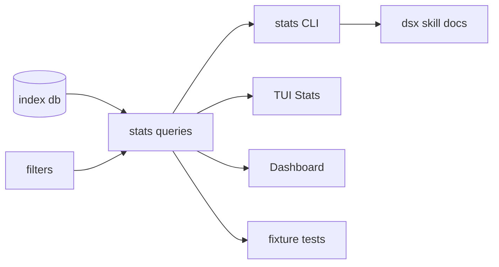

## Goal
Implement the high-value analytics permutations we identified: time-series by model/project/tool, scoped TUI stats filters, normalized efficiency metrics, distribution views, and corrected subagent/exec handling, while preserving existing stable JSON shapes for current commands.

## Scope
- No DB schema migration. Use existing `sessions`, `messages`, `blocks`, and `edges` tables.
- Existing `stats --by day|model|project|tool|hour --json` shapes remain compatible.
- New CLI surfaces are additive, except fixing stats default scope to match existing docs: exclude subagent and droid-exec sessions unless explicitly included.
- Update only the companion dsx skill docs required by repo rules, not README.

## Implementation Plan

### 1. Query layer, `src/query/stats.ts`
- Extend `StatsFilters` with:
  - `model?: string`
  - `includeSubagents?: boolean`
  - `includeExec?: boolean`
- Fix `sessionWhere()` so default stats exclude `is_subagent = 1` and `is_exec = 1`; `includeSubagents/includeExec` opt back in.
- Add shared usage row helpers/types:
  - `UsageMetric` for `credits`, `inputTokens`, `outputTokens`, `totalTokens`, `messages`, `sessions`, `toolCalls`, `toolErrors`, `errorRate`, `creditsPerOutputToken`, `creditsPerActiveHour`, `tokensPerMessage`.
  - `deriveUsageRates(row)` for normalized columns without duplicating math in CLI/TUI.
- Add multi-axis queries:
  - `byDayGroup(db, group: "model" | "project", filters): DailyGroupUsage[]`
    - Same assistant-message pro-rating as `byDay`, keyed by `(day, group)`.
  - `byGroupPair(db, left: "project" | "model", right: "project" | "model", filters): GroupPairUsage[]`
    - First shipped use: model × project.
  - `byToolMatrix(db, group: "day" | "project" | "model", filters): ToolMatrixUsage[]`
    - Uses actual tool-use timestamps and joined tool results for error counts.
  - `bySegment(db, filters): SegmentUsage[]`
    - Segments `main`, `subagent`, `exec`; useful for explaining what `--all` changes.
  - `distribution(db, metric: "credits" | "tokens" | "active" | "toolErrors", filters): UsageDistribution`
    - Percentiles plus fixed bucket rows for histogram rendering.
- Keep fork inflation explicit: do not pretend exact fork-chain incremental spend can be recovered from current data. Where family/fork context is shown, expose `rawCredits`/`maxSessionCredits` naming rather than a fake “true total”.

### 2. CLI analytics, `src/cli/commands/stats.ts`
- Add filters:
  - `--model <substring>`
  - `--all` to include subagent and exec sessions, consistent with `dsx list --all`.
  - `--metric <metric>` for chart-oriented human views, default `credits`.
- Add `--by` values:
  - `day-model`
  - `day-project`
  - `project-model`
  - `day-tool`
  - `project-tool`
  - `model-tool`
  - `segment`
  - `dist`
- Human output:
  - Existing one-axis views stay table-first.
  - Day-group views show top groups with sparklines/small multiples plus totals.
  - Tool matrix views show calls, errors, error rate, sessions.
  - Distribution view shows p50/p90/p95/max and ASCII buckets.
- JSON output:
  - Existing shapes unchanged for existing `--by` values.
  - New `--by` values return direct typed arrays/objects matching query layer interfaces.

### 3. TUI Stats view, `src/tui/views/Stats.tsx`
- Reuse the existing `Insights` filter pattern:
  - `w` cycles `all/7d/30d/90d`.
  - `p` edits project filter.
  - `m` edits model filter.
  - `a` toggles main-only vs all sessions.
  - `v` cycles metric.
  - `tab` still cycles dimensions.
- Expand dimensions to include:
  - `model`, `project`, `day`, `day-model`, `day-project`, `tool`, `day-tool`, `segment`, `dist`, `hour`.
- Render strategy:
  - Flat dimensions: compact text tables with normalized rate columns.
  - `day`: table plus selected metric sparkline.
  - `day-model`/`day-project`: small-multiple sparklines for top N groups.
  - `day-tool`: top tool call/error sparklines.
  - `dist`: histogram bars.
- Preserve input focus safety: use `app.setInputActive(true)`, defer focus with `setTimeout`, and ignore global shortcuts while editing, matching `Insights.tsx`.

### 4. Dashboard and app hints
- Update `Dashboard.tsx` to use corrected default stats scope, so top-level totals match documented “main sessions only” semantics.
- Keep dashboard simple: retain daily credits, but label scope clearly and use the improved query defaults.
- Update `src/tui/app.tsx` footer hints for new Stats shortcuts.

### 5. Tests without over-coverage
Canonical owning suite: `tests/indexer.test.ts`, because these are query/index integration contracts over SQLite fixtures.

Add/adjust fixtures in `tests/fixtures.ts`:
- A second day with assistant activity.
- A second model and project.
- At least one exec-tagged settings file.
- Tool calls/errors on distinct days.

Add focused tests:
- Stats default excludes subagent/exec; `{ includeSubagents: true, includeExec: true }` includes them.
- `byDayGroup("model")` uses message-count pro-rating and groups by model/day.
- `byDayGroup("project")` returns project/day keys correctly.
- `byToolMatrix("day")` counts actual tool calls and tool errors by tool/day.
- `distribution()` returns meaningful percentiles and non-vacuous buckets.
- No separate end-to-end CLI test unless a JSON contract cannot be proven through the query layer.

### 6. Required skill docs
Update:
- `skills/dsx/SKILL.md`
- `skills/dsx/references/commands.md`
- `skills/dsx/references/interpreting.md`

Document:
- New `stats --by` values.
- `--model`, `--metric`, `--all` semantics.
- Default exclusion of subagent/exec sessions.
- Fork-chain inflation caveat and any `rawCredits`/`maxSessionCredits` wording.

## Worker Orchestration After Approval
- Heavy worker A: query layer implementation in `src/query/stats.ts` plus fixture/query tests only.
- Medium worker B: CLI rendering and command docs after query types are stable.
- Medium worker C: TUI Stats/Dashboard/app footer after query types are stable.
- Medium read-only reviewer: audit tests for duplicate/over-broad coverage using the consolidate-test-suites rules.
- Heavy/medium verification assist: independently run/inspect validators and TUI behavior, read-only.

Workers will not edit the same file concurrently. I will integrate each atomic diff, run local checks, and resolve conflicts centrally.

## Verification Plan
- Narrow iteration: `bun test tests/indexer.test.ts`
- Full validators before handoff:
  - `bun test`
  - `bunx tsc --noEmit`
  - `bun run build`
- TUI verification with tuistory or an actual terminal:
  - Launch `bun --preload @opentui/solid/preload run src/index.ts --no-refresh tui`.
  - Open Stats, cycle dimensions, edit project/model filters, toggle window/scope/metric, confirm clean exit.
- If preparing a commit/release-quality handoff, also run:
  - `bun run compile`
  - `./dist/dsx-* --no-refresh list -n 2`